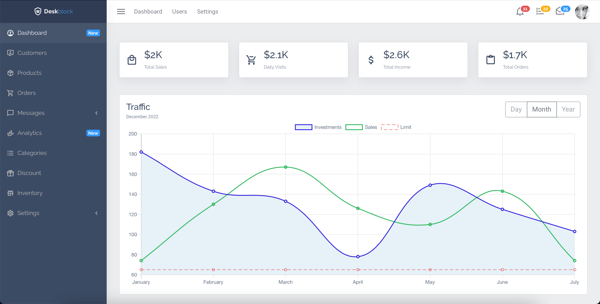
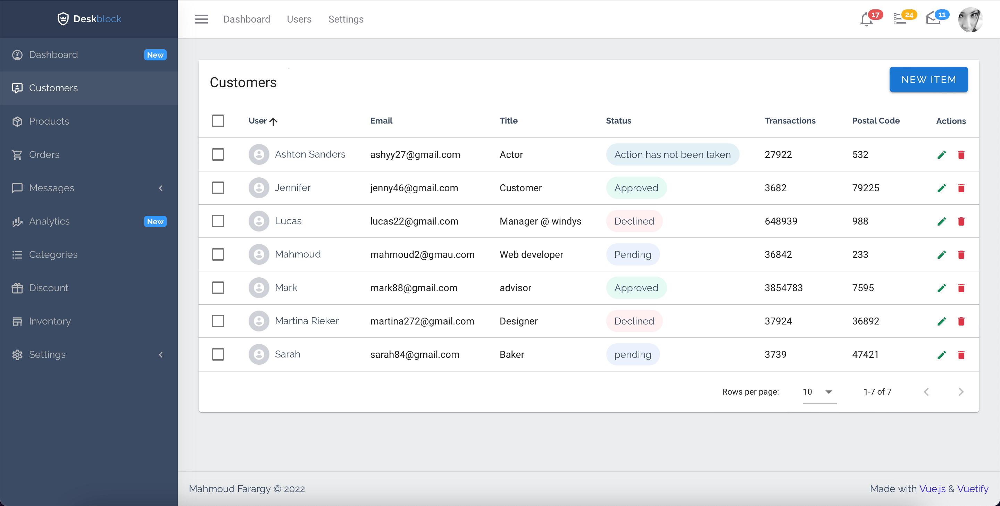
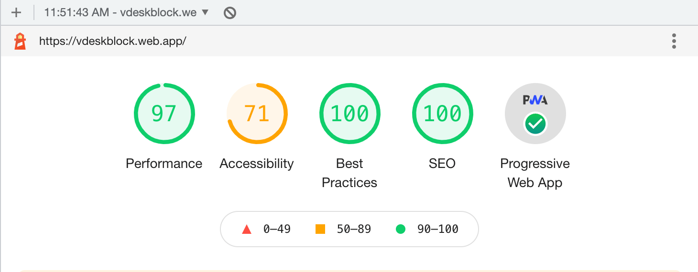

# Deskblock

An admin dashboard with data tables and charts.

# Preview




# Lighthouse test results


Built with:

- [Vue.js](https://vuejs.org/v2/guide/)
- [Vuetify](https://vuetifyjs.com/en/getting-started/installation/)
- [Charts.js](https://vue-chartjs.org/)

## Getting Started

1. Clone project
    ```
    git clone https://github.com/Mahmoud-farargy/admin-dashboard.git
    ```
    
2. Install dependencies

   ```npm
   install
   ```

3. Fire up the server and watch files

   ```bash
   yarn dev
   ```

## Deployment

1. Start app
   ```
   npm run start
   ```
2. Test

   ```
   npm test
   ```

3. Build
   ```
   npm run build
   ```
4. Deploy!

   ```
   firebase deploy
   ```

